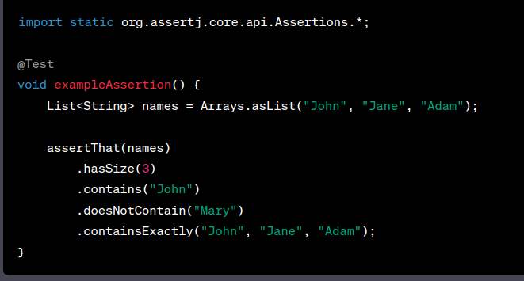

# Testing Best Practices using JUnit 5 and Mockito

This repository contains examples of best practices for testing controllers, services, and repositories using modern technologies. The examples demonstrate the effective use of testing frameworks and tools such as JUnit, Mockito, AssertJ, Testcontainers, and Spring Boot's testing annotations.

## Folder Structure

* `sb-datajpatest`: This folder contains examples of testing repositories using the @DataJpaTest annotation and configuring a test database.

* `sb-testcontainers`: Here, you can find examples of testing repositories and services using the Testcontainers library, which provides lightweight, disposable containers for database integration testing.

* `sb-webmvctest`: This folder demonstrates how to test controllers using the @WebMvcTest annotation, which allows for focused testing of the web layer.

* `sb-testing`: This folder includes various examples showcasing different testing scenarios and best practices, such as testing exceptions, using parameterized tests, testing lifecycle hooks, and more.

* `other examples`: This folder includes various examples of assertj, simple unit testing, junit rules, mockito examples, mockito verify, parameterized tests, testing service using JUnit 4 and JUnit 5, testing exception, test lifecycle, and so on...

## Additional Testing Frameworks and Annotations

In addition to the mentioned testing frameworks and annotations, there are a few more commonly used ones that can enhance your testing approach:

### Annotations used mostly in service testing:

* `@ExtendWith(MockitoExtension.class)`: This annotation is used to enable the use of Mockito in your tests. It extends the test class with Mockito's JUnit 5 extension.

* `@Mock`: This annotation is used to create a mock object of a class or interface that you want to simulate or stub behavior for.

* `@InjectMocks`: This annotation is used to inject mocked dependencies into the test subject (usually a service) being tested.

* `@Spy`: This annotation is used to create a partial mock of a class, allowing you to retain the original behavior of certain methods while mocking others.

### Annotations used mostly in controller testing:

* `@WebMvcTest`: This annotation is used for testing Spring MVC controllers. It loads only the web layer components, allowing focused testing of controllers while mocking the other layers' dependencies using @MockBean.

* `@MockBean`: This annotation is used to create and inject mock objects into the Spring ApplicationContext for testing purposes. It is typically used to mock dependencies of the controller being tested.

* `@Autowired`: This annotation is used to inject dependencies into test classes or fields.

### Annotations used mostly in repository testing:

* `@DataJpaTest`: This annotation is used for testing JPA repositories. It provides a lightweight context that only loads the necessary components for testing repositories, including an embedded database.

* `@Testcontainers`: This annotation, along with other related annotations like **@Container** and **@DynamicPropertySource**, is used to integrate Testcontainers library with repositories for database integration testing.

These annotations, when used in testing, allow you to mock dependencies, isolate specific layers, and perform targeted testing on individual components. They facilitate the creation of meaningful and focused tests by providing mechanisms for mocking, dependency injection, and specialized test context configuration.

By utilizing these annotations effectively, you can write comprehensive and robust tests for your services, controllers, and repositories, ensuring the correctness and reliability of your application.

### Usage of @SpringBootTest

`@SpringBootTest` is a powerful annotation that can be used for integration testing in Spring Boot applications. 
It starts the whole application context, loads all beans, and configures the application as it would run in a production environment. 
While it provides great flexibility, it also comes with downsides, such as slower test execution and the need for additional configuration to isolate dependencies. 
It is recommended to use more focused annotations like **@ExtendWith(MockitoExtension.class), @WebMvcTest, @DataJpaTest + @Testcontainers** whenever possible to achieve faster and more targeted testing.

## AssertJ Library

AssertJ is a fluent assertion library that provides a more expressive way of writing assertions in tests.

`assertThat`: This method is used to perform various assertions on a given object, such as checking equality, comparing values, or verifying conditions.

`assertThrows`: This method is used to assert that a specific exception is thrown when executing a certain piece of code.

**Some key features and benefits of AssertJ include:**

1. `Fluent API`: AssertJ's fluent API allows you to write assertions in a natural and readable manner, resembling plain English. This makes your test code more self-explanatory and easier to understand.

2. `Rich assertion methods`: AssertJ provides a wide range of assertion methods for various data types, including primitives, collections, strings, exceptions, and more. These methods cover a wide range of scenarios, allowing you to write precise assertions.

3. `Chained assertions`: You can chain multiple assertions together, making it easy to perform complex assertions in a single line of code. This chaining capability allows you to create more expressive and concise assertions.

4. `Error messages`: When an assertion fails, AssertJ provides detailed and informative error messages that help you quickly identify the cause of the failure. The error messages include clear descriptions of the expected and actual values, making debugging easier.

5. `Type safety`: AssertJ leverages Java's type system to provide compile-time safety for your assertions. This helps catch errors early and ensures that you're performing valid assertions on the appropriate types.

6. `Integration with IDEs`: AssertJ integrates well with popular Java IDEs, providing auto-completion and intelligent code suggestions. 

## Testing Patterns: AAA and GWT

* `AAA (Arrange-Act-Assert)`: AAA is a common testing pattern that helps organize test code and makes test cases more readable and maintainable. 
  * In the **Arrange** phase, you set up the necessary preconditions and create objects. 
  * In the **Act** phase, you perform the action or operation being tested. 
  * In the **Assert** phase, you verify the expected outcomes and assert the results.

* `GWT (Given-When-Then)`: GWT is a testing pattern that emphasizes expressing test cases in a natural language format. 
  * In the **Given** section, you set up the initial state and preconditions for the test. 
  * In the **When** section, you describe the action or event that triggers the behavior you want to test. 
  * In the **Then** section, you specify the expected outcomes and assert the results.

By following these patterns, your tests become more structured, readable, and easier to maintain.